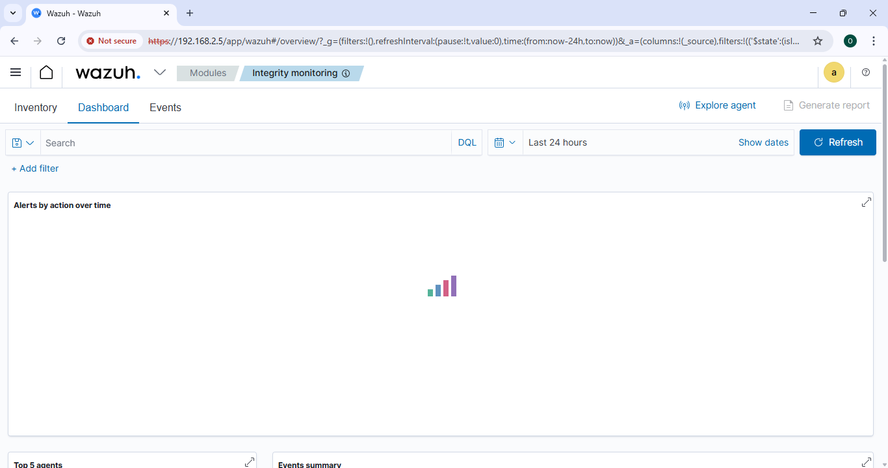
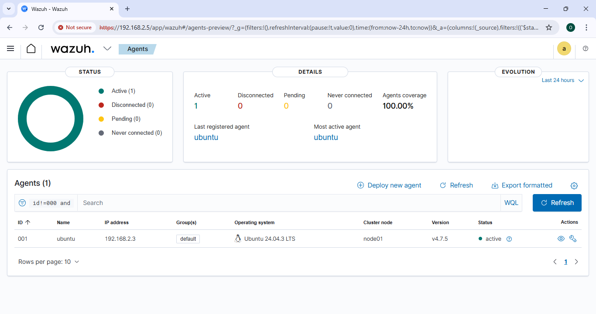
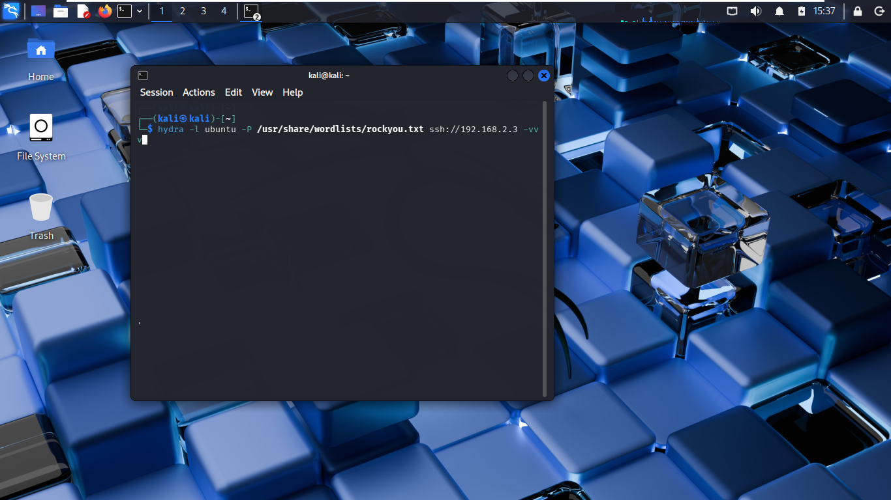
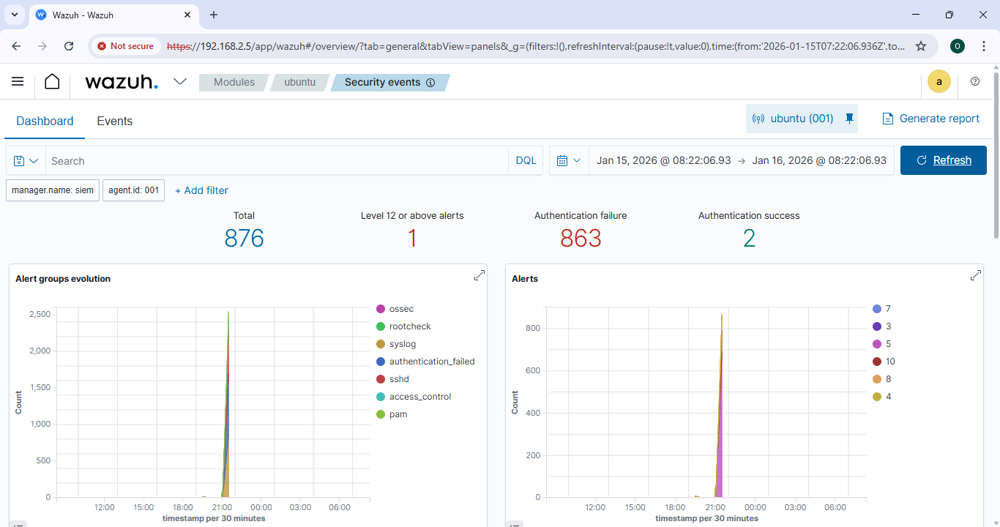
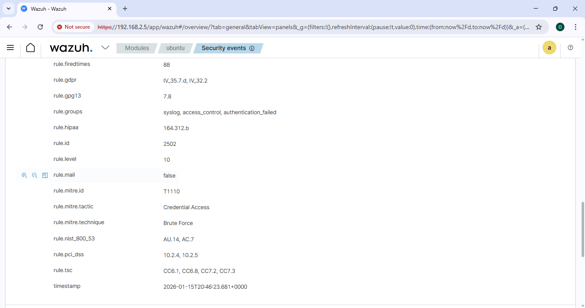
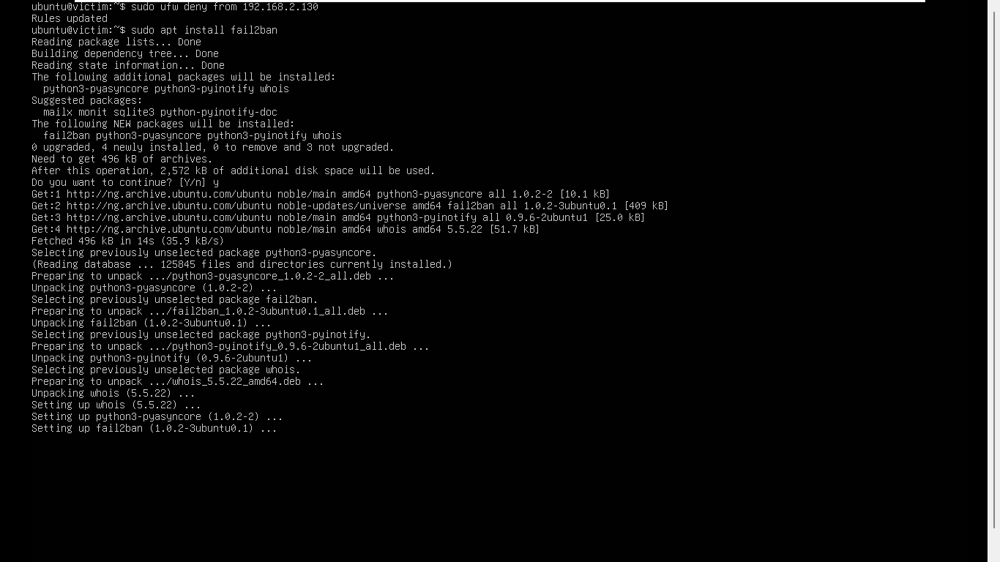

# 📊 SOC Incident Detection & Response Report

## 1. Executive Summary
This report documents a simulated cyber attack detected and analyzed using **Wazuh SIEM** in a controlled SOC lab environment.

---

## 2. Lab Setup
Three virtual machines were deployed to simulate attacker, victim, and SOC infrastructure.

---

## 3. Wazuh Installation
The Wazuh SIEM server was installed in an all-in-one configuration.

---

## 4. Agent Deployment
The Wazuh agent was installed on the victim machine and successfully connected.

---

## 5. Attack Simulation
An SSH brute-force attack was launched from the attacker machine.

---

## 6. Alert Detection
Wazuh generated alerts indicating multiple failed SSH login attempts.

---

## 7. Incident Investigation
The alert was investigated by analyzing authentication logs.

---

## 8. Response & Mitigation
The attacking IP was blocked and preventive controls were implemented.

---

## 9. Conclusion
This project demonstrates practical SOC capabilities including detection, analysis, and response using Wazuh SIEM.
